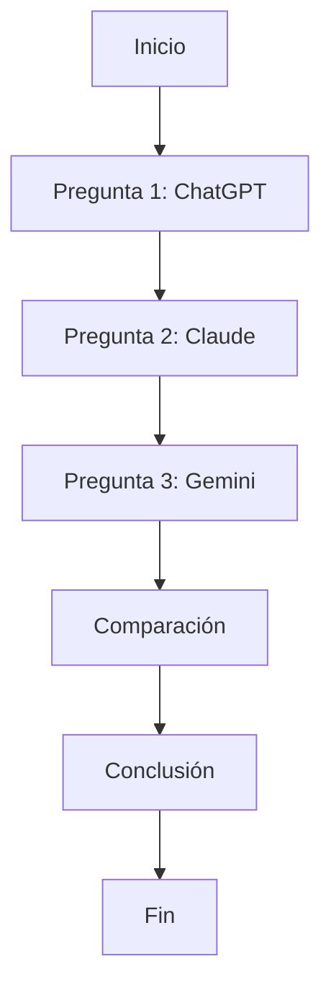

# Evaluación 02 - IA

Evaluación sobre el uso de herramientas de inteligencia artificial para resolver diferentes casos prácticos.


## Índice

- [Pregunta 1: ChatGPT](#pregunta-1-chatgpt)
- [Pregunta 2: Claude](#pregunta-2-claude)
- [Pregunta 3: Extracción JSON](#pregunta-3-extracción-json)
- [Comparación](#comparación)
- [Conclusión](#conclusión)

## Pregunta 1: ChatGPT

Análisis de reseñas de RutaFácil mediante prompts estructurados.

### Prompt inicial

```text
Resume estas reseñas:

1. "El pedido llegó 50 minutos tarde y la comida fría."
2. "La app se cerró dos veces al pagar con Yape."
3. "El repartidor fue muy amable, todo perfecto."
4. "Tercera vez que mi pedido llega tarde este mes."
5. "El costo de envío subió a S/ 9, es demasiado."
6. "No puedo ver el seguimiento del pedido en el mapa, se queda cargando."
7. "Llegó con una hora de retraso y faltaba una bebida."
8. "Escribí al chat de soporte y nadie respondió en 2 días."
```

### Prompt final

```text
Actúa como analista de producto especializado en análisis de reseñas.

Contexto: RutaFácil recibe reseñas de sus usuarios y necesita identificar los problemas más frecuentes para definir prioridades.

Tarea: analiza las 8 reseñas, clasifica los problemas, cuenta cuántas reseñas corresponden a cada categoría y propone 3 acciones prioritarias.

Formato: presenta los resultados en una tabla Markdown con las columnas Categoría | Cantidad | Ejemplo. Después indica 3 acciones prioritarias y justifica cada una.

Restricciones: usa únicamente la información de las 8 reseñas, no inventes datos y considera que una reseña puede mencionar más de un problema.
```

### Refinamiento

La primera respuesta generó la tabla correctamente, pero no incluyó las 3 acciones solicitadas. Se realizó 1 refinamiento para pedir específicamente las acciones prioritarias y su justificación.

### Verificación

El conteo manual coincidió con el resultado de la IA:

* Retraso en la entrega: 3
* Fallos de la app/pago: 1
* Costo de envío: 1
* Seguimiento del pedido: 1
* Pedido incompleto: 1
* Falta de respuesta de soporte: 1

La reseña 7 fue contada en dos categorías porque menciona retraso y pedido incompleto.

### Evidencias


## Pregunta 2: ClaudeAI

### Prompt directo

```text
Calcula el costo mensual actual y el costo mensual optimizado del chatbot de EduTech. También indica el ahorro porcentual y si cada escenario cumple con el presupuesto de US$900.

Datos:
- 4,000 consultas por día durante 30 días.
- 1,200 tokens de entrada por consulta.
- 300 tokens de salida por consulta.
- Entrada: US$3 por millón de tokens.
- Salida: US$15 por millón de tokens.
- Optimización: reducir la entrada a 700 tokens por consulta.

Responde solo con los cuatro resultados finales, sin explicar los cálculos.
```

### Prompt final

```text
Actúa como analista financiero de TI.

<contexto>
EduTech lanzará un chatbot con un presupuesto de US$900 mensuales. Se necesita comprobar si el presupuesto alcanza.
</contexto>

<datos>
- 4,000 consultas por día durante 30 días.
- 1,200 tokens de entrada y 300 de salida por consulta.
- Entrada: US$3 por millón de tokens.
- Salida: US$15 por millón de tokens.
- Optimización: reducir la entrada a 700 tokens y mantener 300 de salida.
</datos>

<tarea>
Calcula el costo mensual actual, el costo optimizado, el ahorro porcentual y si cada escenario cumple el presupuesto de US$900.
</tarea>

<razonamiento>
Haz los cálculos paso a paso y verifica las operaciones.
</razonamiento>

<formato>
Muestra un resumen breve y coloca los resultados finales dentro de <respuesta>.
</formato>

Antes de responder, revisa nuevamente todos los cálculos y corrige cualquier error.
```

### Cálculo manual

* Consultas mensuales: 4,000 × 30 = **120,000**
* Costo actual: **US$972**
* Costo optimizado: **US$792**
* Ahorro: **US$180 (18.52%)**

Los resultados coinciden con Claude. El costo actual supera el presupuesto de US$900, mientras que el optimizado sí lo cumple.

### Evidencias


## Pregunta 3: Extracción JSON

### Esquema JSON

```json
{
  "nombre": "string",
  "puesto": "string",
  "anios_experiencia": "number",
  "tecnologias": ["string"],
  "disponibilidad": "string",
  "pretension_soles": "number o null"
}
```

### Zero-shot

```text
Convierte los siguientes 3 correos al formato JSON indicado.

Campos: nombre, puesto, anios_experiencia (number), tecnologias (lista), disponibilidad, pretension_soles (number o null).

1. Rosa Quispe, Backend Developer, 3 años con Python/Django y algo de Docker. Empieza el 1 de diciembre. Pretensión: S/4,500.

2. Diego Ramírez, Frontend, 1 año y medio con React/TypeScript. Disponibilidad inmediata. Sin pretensión salarial.

3. Lucía Fernández, QA Automation, 5 años con Selenium/Cypress/Java. Disponible en 2 semanas. Pretensión: S/6,000.

Devuelve solo el JSON.
```

### Few-shot

Se utilizaron 3 ejemplos para enseñar al modelo la estructura JSON, el uso de `null` y la conversión de "año y medio" a `1.5`.

```text
Ejemplo 1:
Ana Torres, Backend Developer, 2 años con Python y Django, disponible en 1 mes, S/4000.
→ anios_experiencia: 2

Ejemplo 2:
Luis Pérez, Frontend, 1 año con React, disponibilidad inmediata, sin pretensión.
→ pretension_soles: null

Ejemplo 3:
Carla Ruiz, QA, año y medio con Selenium, disponible en 2 semanas, S/3500.
→ anios_experiencia: 1.5
```

Después se aplicaron estos ejemplos a los tres correos de la actividad.

### Validación

Los resultados zero-shot y few-shot fueron validados en un validador JSON y ambos fueron válidos. El few-shot siguió mejor el formato solicitado, especialmente en los números, listas y valores `null`.

### Evidencias


## Comparación

| Criterio                   | ChatGPT       | Claude        | Gemini        |
| -------------------------- | ------------- | ------------- | ------------- |
| Calidad                    | 5/5           | 5/5           | 4/5           |
| Precisión                  | Alta          | Alta          | Alta          |
| Precio                     | Plan gratuito | Plan gratuito | Plan gratuito |
| Prompt para resultado útil | Medio         | Medio         | Corto         |
| Tokens/costo aproximado    | Bajo          | Bajo          | Bajo          |

ChatGPT fue útil para analizar las reseñas, Claude para los cálculos financieros y Gemini para la extracción de datos en JSON.

### Flujo de trabajo



### Checklist

* [x] Pregunta 1: análisis de reseñas con ChatGPT.
* [x] Pregunta 2: cálculo de costos con Claude.
* [x] Pregunta 3: extracción JSON con Gemini.
* [x] Prompts registrados.
* [x] Resultados verificados.
* [x] Comparación de herramientas.
* [x] Conclusión.
* [ ] Capturas agregadas al repositorio.
* [ ] README subido a GitHub.

## Conclusión

En esta evaluación se utilizaron ChatGPT, Claude y Gemini para resolver diferentes tareas mediante prompts. ChatGPT fue útil para analizar las reseñas de RutaFácil, identificar las categorías y encontrar los problemas más frecuentes. Claude destacó en el cálculo de costos del chatbot de EduTech, ya que los resultados obtenidos coincidieron con los cálculos manuales. Gemini permitió trabajar con extracción de información y formato JSON mediante las técnicas zero-shot y few-shot.

Los resultados mostraron que la forma de escribir el prompt influye bastante en la respuesta obtenida. Un prompt más estructurado permite obtener resultados más ordenados y precisos. En el caso de Gemini, los ejemplos del few-shot ayudaron a establecer mejor el formato esperado, incluyendo números, listas y valores `null`.

Para esta evaluación, Claude fue la herramienta que presentó el resultado más claro para los cálculos financieros. ChatGPT fue más útil para el análisis de texto y Gemini para la extracción estructurada. En general, las tres herramientas pueden ser útiles dependiendo del tipo de tarea y de cómo se formule el prompt. También es importante revisar los resultados manualmente para comprobar que no existan errores.
